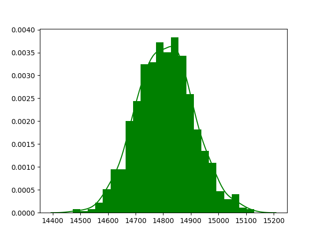

# seedbox-test performed by Alexandre Pelletier (a.pelletier0x7c9@gmail.com)

## Environment 
OS: Scientific Linux 7.3/Windows 7
Technologies used: Apache Spark 2.2.0 (Pyspark - Python 3.5.1), matplotlib, seaborn, scipy

## Analysis

### Probability Distributions
With n = 59721, our two groups are split quite unevenly with 44886 in the control group and 14835 in the test group.
If we denote our control group as A and our test group as B we have the following exact probabilities (to three significant figures):

P(A) = 0.752
P(B) = 0.248

Considering that the distribution is clearly binomial (dichotomy: you are either in the control group or the test group), we can use either normal or Poisson approximation to determine the "approximate probability distribution". Without knowing our N (population size) it is difficult to say whether n is large enough to yield a result which can be approximated, though in most realistic cases it would be more than enough (where population sizes are not astronomical). We can also say that because n * P(A) or n * P(B) would result in relatively large numbers, thus a Poisson approximation would not be ideal. From all this, a normal approximation to the binomial distribution can be used to approximate the probability of any given number of individuals being in the control or test group.

### Rebill Comparison
With the total number of rebills being 6961, my analysis found that 3756 of these were from the control group, and 3205 of these were from the test group.
Removing duplicate rebills (rather, multiple rebills that were made by the same user) I found that there were precisely 941 control group users who had at least 1 rebill and 1556 test group users who had at least 1 rebill.

From the second analysis it clearly follows that those in the test group were more likely to have at least 1 rebill.
~2.10% of users in control group rebilled at least once
~10.5% of users in test group rebilled at least once

### Revenue Comparison
Of the total number of transactions in the sample (7430), 4050 were from the control group while 3380 were from the test group. The total revenues from both groups were ~89838.90 and ~95433.50 respectively.
From these results we can see that while the proportion of transactions from the test group is smaller than those of the control group, the test group is responsible for more overall revenues, thus we can conclude that the test group (being a representative sample of all users who have to call-in) is disproportionately responsible for giving the company revenue from these transactions.

Further analysis revealed that there were 1082 unique control group users who had at least 1 transaction and 1643 unique test group users who had at least 1 transaction.
From this I found that the average total transaction amount for users who had a transaction of any type is:
~83.03 for control group
~58.08 for test group

The average total transaction amount for all users (thus here we expand our scope to include users who have no transactions and assign them a default transaction amount of 0):
~2.00 for control group
~6.43 for test group

Given all these results we can conclude that users who call-in do in fact generate more revenue on average when we take into consideration the sheer amount of control group users who do not make any transactions at all. The proportion of test group users who have at least 1 transaction is simply greater which means they not only contribute more overall, they contribute more per capita.

### Chargeback Rate Comparison
ASSUMPTION: I recognize the chargeback rate to be any transaction amount value which is negative - thus my analysis is done believing that the relevant transaction_type is REFUND and CHARGEBACK.

My analysis showed that there were 294 chargebacks/refunds from the control group and 175 chargebacks/refunds from the test group. The net amount for both groups is ~ -7520.30 and ~ -5436.25 respectively. The number of unique users who used the target transaction type is 141 and 87 respectively.

Following the same procedure as in the revenue analysis, the average transaction amount for chargebacks and refunds for users who had at least 1 transaction of type CHARGEBACK/REFUND is:
~ -53.34 for control group
~ -62.48 for test group

The average transaction amount for chargebacks and refunds across all users:
~ -0.13 for control group
~ -0.37 for test group

From these results it follows that while the control group contributed more overall to the negative transaction amount, each individual user in the test group contributed more on average than members of the control group with respect to both users who had at least 1 chargeback/refund and all users (even those who did not contribute anything). Thus, we can conclude that users in the test group produce higher chargeback rates on average.

## Conclusions and Statistical Significance

Calculations were done using abtestguide.com's A/B Testing Significance Calculator at a confidence of 95%.

In the case of an A/B test our concern is the conversion rate, specifically how the control and test groups differ on a given issue.

### Rebill Comparison

In this case we are seeing a 400.31% conversion rate increase for the test group, according to our confidence this is statistically significant and not a result of random chance.

### Revenue Comparison

When looking at whether the number of users who make transactions we see a 359.45% conversion rate increase for the test group and according to our confidence this is statistically significant and not a result of random chance. This does not necesarrily relate directly to total revenues.

### Chargeback Rate Comparison

Once again we are looking at simply the number of transactions which match our target (REFUND/CHARGEBACK); here we see a 86.69% higher conversion rate for the test group which at our confidence level is statistically significant.